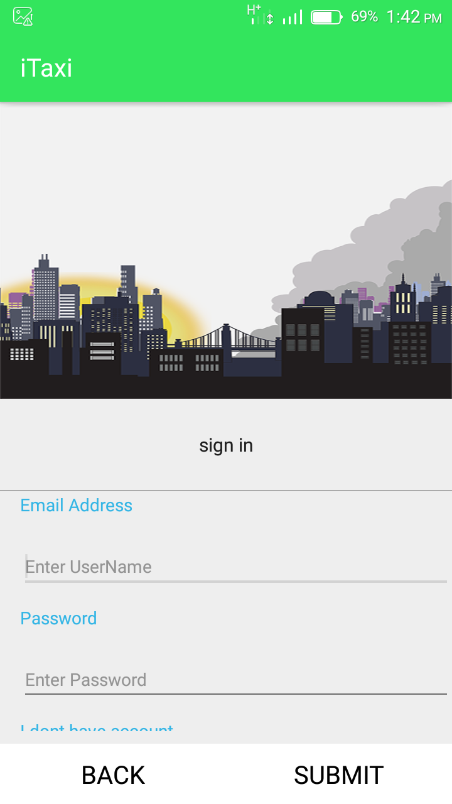
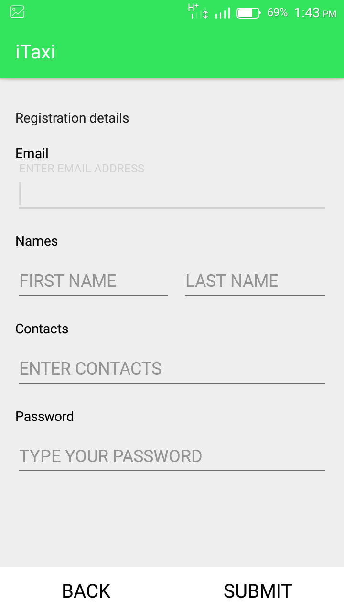
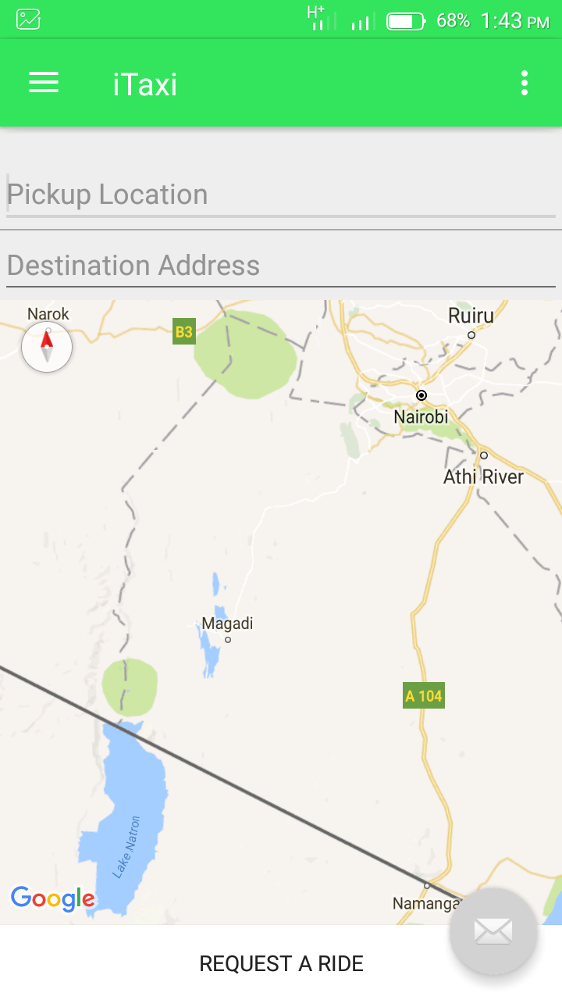
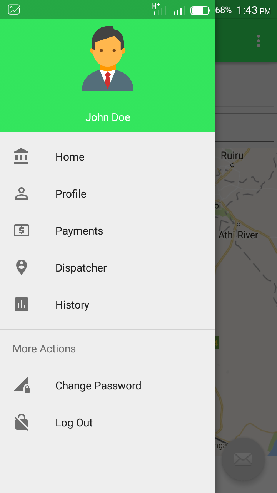
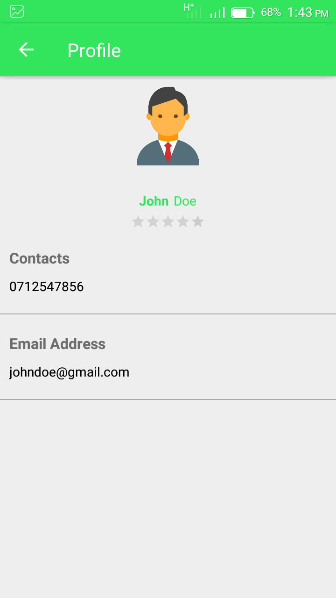

# Android taxi app template design
The UI template for a taxi booking android app

Want to start developing taxi booking and management application? Close this design template and get going in no time.

The project has several screens and has been developed with native android.

